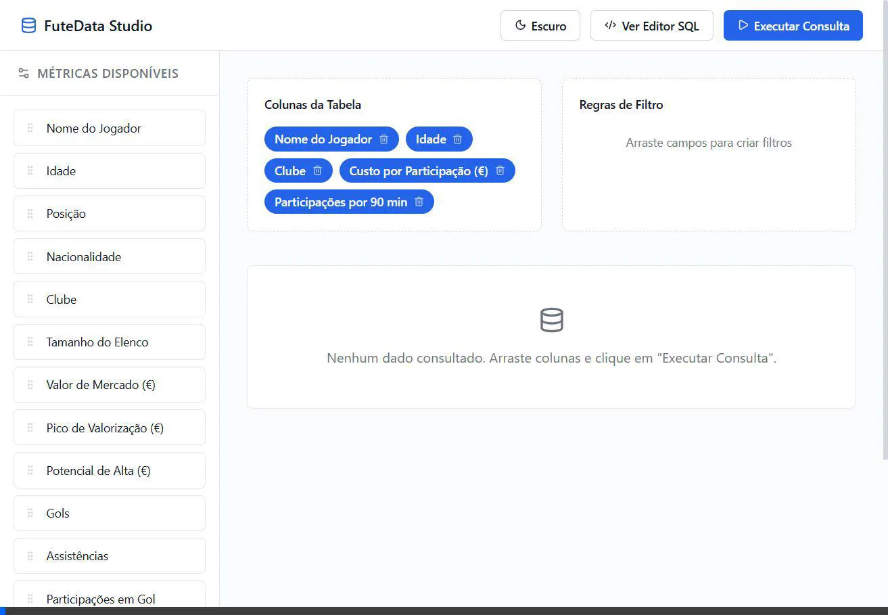

# ⚽ FuteData: Global Intelligence & BI Studio


<p align="center">
  
</p>

O **FuteData** é um Data Lakehouse analítico ponta-a-ponta que consome, trata e disponibiliza dados de milhares de jogadores e times do Transfermarkt, coroado por uma ferramenta de **Business Intelligence Self-Service (BI Studio)** para exploração interativa.

---

## 🌟 O que a plataforma faz?

Ao invés de entregar dashboards engessados, o FuteData traz o **FuteData BI Studio**. Inspirado no Metabase e Tableau, ele permite que usuários sem conhecimento em SQL criem consultas complexas com um simples **Drag-and-Drop** de métricas em um Canvas interativo.

### Principais Features do BI:
- **Camada Semântica Invisível:** O backend gera queries SQL dinâmicas contra a `vw_master_scout` (Wide Table), realizando joins e cálculos complexos em tempo real.
- **Métricas Avançadas Nativas:** A arquitetura já calcula inteligência de scout, como *Custo de Investimento por Participação em Gol*, *Participações a cada 90 Minutos* e *Upside Value* (Potencial de Lucro).
- **Player Profile 360:** Clicando no nome de um jogador na tabela, um painel desliza (Drawer) mostrando foto, atributos, contrato e eficiência financeira.
- **Dark/Light Mode:** Interface de altíssimo nível "SaaS B2B Minimalista".

---

## 🏗️ Arquitetura do Projeto

1. **Camada de Engenharia (Python):** Scripts ETL (`run_load.py`, `run_transform.py`) processam o dado bruto usando `soccerdata` e estruturam o Data Lake local.
2. **Camada Analítica (SQL Server):** Tabela Fato e Dimensão Modeladas via Modelagem Dimensional. Criação de *Views Analíticas* pesadas que empurram o processamento lógico para o banco.
3. **Camada de API (FastAPI):** Uma interface REST rápida comunicando com o banco de dados via `pymssql`.
4. **Camada de Apresentação (React/Vite):** Frontend construído com drag-and-drop HTML5 nativo e Vanilla CSS (focado em performance e independência de frameworks).

---

## 🚀 Como Rodar o Projeto (Plug and Play)

Graças ao Docker Compose, toda a infraestrutura (Banco de Dados, API, Frontend) sobe de forma conectada e automática com apenas um comando.

### Pré-requisitos
- Ter o [Docker](https://docs.docker.com/get-docker/) e o [Docker Compose](https://docs.docker.com/compose/install/) instalados na sua máquina.

### Passos:
1. Clone este repositório.
2. No terminal, navegue até a raiz do projeto e execute:
```bash
docker-compose up --build -d
```
*(O banco de dados vai criar suas tabelas, o Python vai instalar a API e o Node vai compilar o React)*

3. Aguarde cerca de 1 minuto (dependendo da máquina) para que a API aguarde o Healthcheck do SQL Server.
4. Acesse pelo navegador: **[http://localhost:5173](http://localhost:5173)**

Se quiser ver os logs dos serviços:
```bash
docker-compose logs -f
```

---

*Desenvolvido como projeto de portfólio em Engenharia de Dados & Fullstack B2B.*
